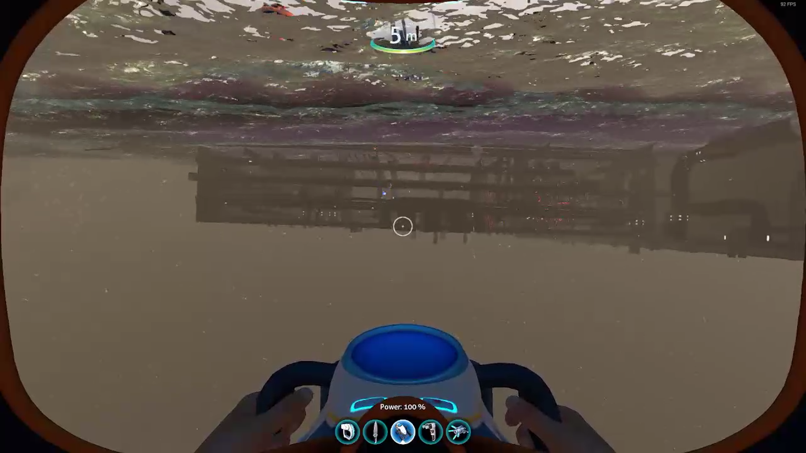
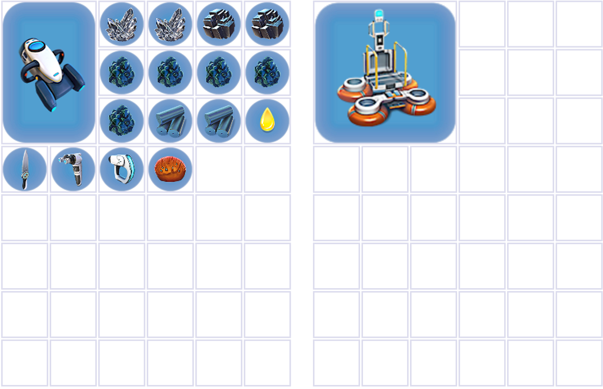
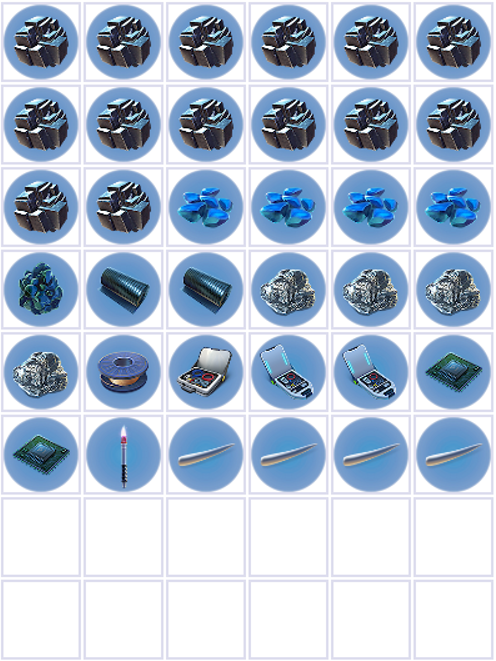

# Aurora + Glide to mountain

## Maintenance Hatch + Rocket blueprint

### Old patch

Head to the tail end of the aurora, and find the maintenance hatch. On your way to the aurora, pick up a metal salvage. When you die, you keep one random item, as well as anything you had in your inventory when you were last in the base, so you'll keep the salvage. Scan any cyclops engine/bridge if there any & your health allows for it (or you brought a medkit).

<YouTubeVideo videoId="uN41z5_tkk0" />

Swim into the rocket, being careful to not go too high up. Swim to roughly the centre, until you see rooms loading in. If you look up you can see the quarters, and you should be able to see a weird underwater pipe room in front of you. Line yourself up with the left of the three pipes, far enough back that they are just loaded in in front of you. If you look directly up, you should see the floor of the room you're going to jump into. Then, jump straight upwards through the floor. If you turn right and run as far down the hallway as you can, you'll find the Captains' quarters on the right. Input the code on the pad to the left of the doorway:

2679

The door will open, and you can grab the rocket blueprints and kill yourself in the fire.

You can also jump directly in front of the Captain's Quarters, it just is a bit harder to find the lineup. Basically just look up when you're under the quarters/hallways area, and line yourself up with the furthers part of the hallway from your lifepod.

### Current patch

The way to get into the aurora on current patch is quite similar, except instead of jumping through the ceiling, you jump onto a balcony and parkour over some boxes. This takes about 20 seconds longer than a fast old patch jump, and as I'm not too familiar with it myself, I'd recommend watching the following clip where aqua demonstrates the clip.

Once again, make sure to grab a metal salvage on your way, and scan any cyclops fragments you see, health permitting.

<YouTubeVideo videoId="3v_LWCobVOg" />

Once you've done the clip, jump up the boxes and head down the corridor. Turn left, and the farthest room on the right is the Captain's Quarters.

Then input the code:

2679

The door will open, and you can grab the rocket blueprints and kill yourself in the fire.

## Inventory management + flare storage

Back at base make the salvage into titanium, and collect the following resources from the right locker: 2 Quartz, 2 Lead, 2 Titanium Ingots, 1 extra titanium,1 Lube, 1 Table Coral, and 1 Flare (may already have this - make sure it's the flare you have already uncapped and used for flare storage previously).

Put MVB (currently on fabricator), in the left locker and activate [flare storage](./flare-storage-sandstone-loop-2#flare-storage) on the locker with the MVB in it.

Your inv + left locker should look something like this:

Your right locker should look something like this (there can be 4 or 5 silver, as long as you have 4, you're good)):

Leave base (with flare storage + SSG activated). Deconstruct the majority of the 2nd Solar panel you constructed when you initially made the base. Deconstruct it for everything except the final quartz, which should leave it a bit below 20% completion. This will keep the power in it stored so we can still use it later. Head to the mountain. To get there, go through the kelp forest where you did teeth, past the seaglide wreck, and into the kelp forest past that.

## Eye stalk + Fish

Going through the kelp forest, and round to the left a bit, you'll find the following cave:

[Insert image]

If you need any extra titanium to reach the 5 you should have, now is your chance to get it. You can break limestone your spot, or if you see any seaglide/mvb fragments you can overscan them to get two titanium.

Slash the eyestalk, and continue in the same direction to go the mountain island. You'll end up following a sort of ridge, with the underwater islands on your left. If you can, grab a fish on your way, which you will use to fish skip the tablet animation.
