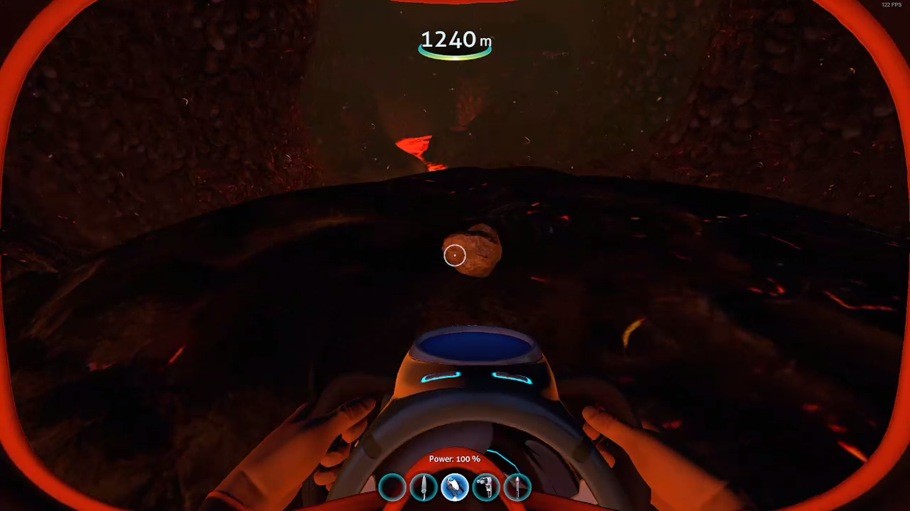
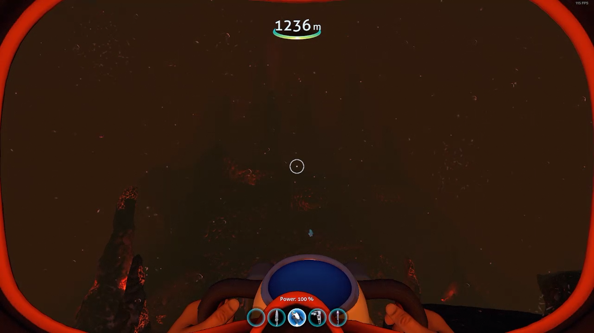
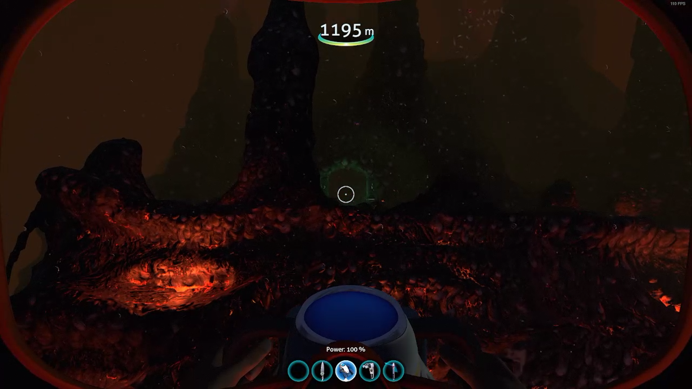
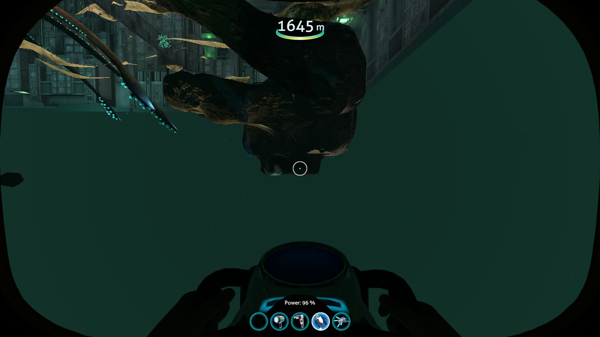

# Lost River + Lava zone

## Ghost Weed

Swim back in bounds to the lost river and slash the ghost weed you see in front of you.

Insert picture

Continue to the left (deeper into the lost river) and you'll see a big hole in the ground that leads you down to the lava zone.

Pray Casper blesses the run.

If you're a bit more experienced in the run and can one breath nickel, you should probably try and manage your health so that you die in one jump at the thermal plant. To help, you can swim in the brine (the green water in the lost river) for a few seconds to take enough damage to bring you down to around 60-70 health (usually 4 ticks of damage). While you're in the brine, you can also collect any free sulfur that could spawn here.

If you aren't going for one breath nickel, you can still take damage (4 ticks) from the brine. Your oxygen will run out faster than your health anyway, so if you have to two breath nickel, this won't make any difference. But, if you do get lucky with nickel, you'll have the right amount of health to do one breath strats anyway.

## Nickel

As you descend the lava zone, look around the lava pools for nickel. You need 3, and it's stupidly hard to find due to how tiny it is.

**1 Extra gold (if necessary)**

If you need to grab an extra gold, you should be able to find some Shale in the lava zone. Don't pick up anything except one gold.

### Moonpool backup

If you're doing nickel and either a) can't find the nickel fast enough, or b) haven't got enough breath to make it to the thermal plant due to a rough MVB clip, you can build a moonpool in the lava zone to make a portable spawn point and get air.

You have to be below 1100/1200m as if not, it won't flood and you won't be able to get SSG.

Once you've built the moonpool, you need to go up into it to set your spawn. You will lose SSG but will get it back in a second after you respawn. You can now go out and look for the last nickel, and if you still have O2 left after finding that, you can die on the lava if it's quicker.

You'll respawn in the moonpool.

If you want to manage your health properly, it's a little trickier without one breathing nickel. Before getting SSG from the moonpool, you can swim out and take some lava damage - you'll have to judge it based off how far you are from the lava castle, but around 50 health should be a reasonable amount. Then you can take different options later depending on how much health you have left at the thermal plant. If you respawn and the moonpool is already fully flooded, so you can't not get SSG, you can also take damage on the lava inside the lava castle.

Swim right up to the ceiling of the moonpool to get SSG, then leave and deconstruct the moonpool.

Once you have all the nickel required, swim up the big volcano looking thing (lava castle?) and find the entrance.

 

If you enter the lava castle with 9 O2 left, you can make it through to the thermal plant, assuming you don't grab any kyanite or sulfur.

## Sulfur + Kyanite

As you navigate this cave, you need to collect 4 sulfur and 4 kyanite. You can get more kyanite in the main room, and you can get OOB sulfur if necessary, but it's recommended to get it all on the way through here. If you're running out of breath, you can leave the cave early to go get air from the thermal plant, and collect the rest after.

As this cave is already a bit tricky to navigate, explaining it is quite difficult. Thus, I recommend you watch the following video to get a good idea of how to navigate it.

## Thermal Plant setup (Moonpool)

Once you've left the little cave, you'll see the thermal plant. Swim up to the right side of it, and you'll see the entrance. You want to build a moonpool right outside the door and set your spawn by swimming up into it (this will also make you briefly lose SSG). If you need air you can of course go into the plant first to get air, then leave and make the moonpool.

If you want to properly manage your health to optimise for the jump, you can take some more damage here. To do so, swim through the thermal plant entrance at the top of it and fall to take a bit more damage. If your health is way too high, you can also swim down to the lava after losing SSG in the moonpool, take some damage, then enter the thermal plant as normal.

## Thermal Plant blueprint + death

Once you've built the moonpool and set your spawn, you're good to head into the thermal plant. Enter the thermal plant, taking damage in the door if you need. Turn right, then jump over the ledge in front of you. You want to be at about 25 health (a quarter visually) before you jump. The normal survival jump will do about half of that in damage, leaving you with enough to die after the blueprint. To do the survival jump, you simply land on the floor all the way at the bottom of the ramp.

[Insert video]

If you have less health than you are comfortable doing the survival jump with, you can instead do the hardcode jump. This has you landing on a little ledge, then hopping down to the floor, so you take less damage.

[Insert video]

If you still have too much health, you can try to get a little robot spider thing to stab you, but this is quite rng heavy, so shouldn't be counted on.

After the jump, continue around the corner. Pick up the ion cube, then place the tablet on the pedestal to the right, to unlock the blueprint room. Run up one of the sides of the room and grab the blueprint in the middle. Then jump off the edge to die. An optimal jump will do about 17 damage, so try to have less than that. If you don't die, just run back up and do another.

You'll respawn in the moonpool.

## Removing setup

Swim to the top of the moonpool to get SSG, then leave and deconstruct it fully. You can then drop two lead, but make sure you have good air before doing this as you can no longer build a moonpool to get more air (going in the thermal plant would lose SSG). Depending on how your inventory is, it may be necessary for you to drop the lead to get the remaining Sulfur and Kyanite. If you still need kyanite, now is the chance to get it. There should be some around the main area with the thermal plant in it, but you may also find some near where you do your clip.

## MVB Clips

You need to choose the correct clip for your spawn point. No matter which clip you do, once you go out of bounds, do not pick up the MVB - leave it there. It will rise to the surface when this section becomes unloaded later. The following video shows both Clip A and Clip C.

<YouTubeVideo videoId="fMpjR__WmzY" />

### Clip A

[Insert image or video]

### Clip C

[Insert image or video]

## OOB sulfur + swim to PCF

Once out of bounds, swim down and under the deep lava zone, making sure not to go back in bounds accidentally.

If you still need sulfur, you'll be able to grab some from out of bounds here. Just make sure to be careful not to go too close to the sulfur and poke your head through the floor.

Continue to swim down and head underneath the PCF (the big green cube). You'll see a cave under the PCF, and you want to aim for the part with the Sea crown + cube in it.

