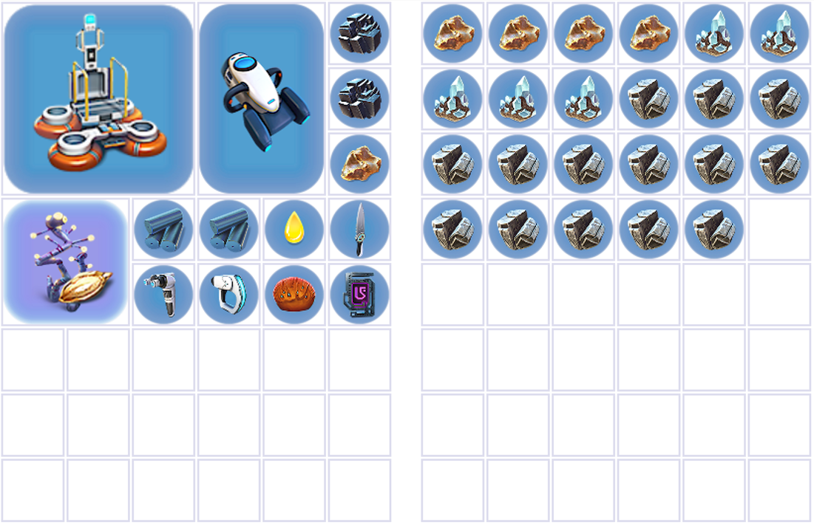

# Mountains/Bulb/Mushroom

When you arrive at the mountain, go to the surface to get full air, and go round to the left. Swim down, basically hugging the side of the mountain, until you come to the following cave:

[Insert image]

Enter the cave, and you'll see a purple tablet on the floor. If you see any cyclops or moonpool fragments on the way, scan them.

## Tablet + Fish skip

When you go into the cave, go up to the tablet and hold out the fish. Release the fish and immediately pick up the tablet, then change to seaglide. This overlays the animations so you can get back your seaglide sooner. Continue in the cave off to the left, then round to the right to exit. 

Here's a link to the timestamp in a video Krooka made, showing fish skip with all the keyboard and mouse inputs:

<YouTubeVideo videoId="NRnThiGyozg" startTime={344} />

This video also explains the duplication glitch, the aurora clip, Ghost Storage, SSG and SSC so it's probably worth just watching the whole thing.

## Lithium and Gold

[Insert video of spire/cave nav?]

Once you leave the cave, start collecting lithium and shale from the spire directly in front of you. You're aiming for 14 lithium + **(5|4) gold. Keep count, as you can't open your inventory to check due to flare storage. Once you've got all the lithium and gold you can see, or are running out of breath (if you're aiming for one breath mountain, you need to start building the base with 85-90 O2 latest), swim to the spire opposite the portal, and do the mountain setup.

You can get away with only getting *(4|3) gold here, as you can grab one more in the lava zone. You can also get away with getting at minimum 10 lithium as you can get backup at the sparse reef, although this isn't really recommended.

### Different gold options

I just want to explain the different options you have, depending on how much gold you are able to collect. I'll touch back on this later in the relevant points, but I just want to clarify here in it's own section as it's easy to gloss over this when skimming the previous paragraphs. While collecting resources at the mountain, you should be hoping to get 5 gold, but can get away with 3 or 4.

If you collect 5, then when you open your flare storage later, you should dump 4 and you're done for collecting gold.

If you collect 4, then when you open your flare storage later, you should dump 3 and during the final crafting section, you will need to deconstruct a fabricator at the end to get the gold to craft the polyaniline (I will explain this again in that section). In theory, you could also dump all 4, and then hope to find a shale (with gold in it) in the lava zone, but this is way more rng, and not recommended.

If you collect 3, then when you open your flare storage later, you should dump all 3 and during the final crafting section, you will need to deconstruct a fabricator at the end to get the gold to craft the polyaniline (I will explain this again in that section). You will also need to get a gold from a shale in the lava zone.

## Mountain Setup

Build a compartment with a solar panel on it, and a hatch. You can also build a ghost glass compartment in front of this base too if you'd like, in the exact same way you do for your shallows base. Start building a compartment next to it, and stop before halfway. This will store a single titanium. If you're not able to one breath mountain, go up to the surface for air when you need it, but don't open PDA unless you've collected all the lithium and gold you need.

You have a choice here. You can collect a second purple tablet here, and save you having to do it later. But, if you do choose to get it now, there is a glitch you should also do later, which tends to be quite finicky/difficult (You can only do the later glitch on old patch, so if you're on current path you can ignore the second tablet). If you don't get the extra tablet, the glitch later is impossible, and if you don't want to do the glitch later, it's not worth getting this extra tablet. Personally, I choose not to get it, but if you would like to here is what you do.

Below the platform with the portal in it, there is actually a tablet that is out of bounds. To get it, you basically have to swim at the surface full speed with SSG, and scroll on the tablet as you clip through - hopefully, one of the mouse inputs will grab the tablet.

[Insert video]

If you do get this tablet, when you do your inventory management in a minute, you will also need to dump one of the tablets in flare storage.

## Wreck (Engine + Moonpool)

If you're facing your compartment, swim down to the left, round the side of the mountain. You'll pass a geyser where you can collect the rest of your lithium and gold. Continue down past there, and you'll see a large wreck. Here you need to scan 3 engine fragments and two moonpool fragments.

[Insert video/clip of navigating that]

The moonpool fragments come in different shapes:

[Insert pictures]

As do the engines:

[Insert pictures]

## Wreck -> MVB Clip + Flare storage

After getting the fragments and resources, continue around the mountain, past the wreck, and you'll see the following structure in the landscape:

[Insert picture]

I've linked the video below, as it's a lot easier to understand how to navigate this part with a visual guide.

<YouTubeVideo videoId="M6GSB8STKSM" />

Head up the steps, and you'll come to a ridge next to a little "U" shape.

[Insert picture]

You basically want to follow the ridge upward, and also go up for air at this time. Once you're at the surface, you can open your PDA to do some more inventory management.

Dump all the diamonds and lithium you have into flare storage. Grab the MVB and dump *(4|3) gold, + any extra random items you may have besides the following: 2 Lead, *(0|1) Gold, 2 Titanium Ingots, 1 Lubricant, 1 Purple tablet, 1 Table coral, and an eyestalk seed. Your flare inventory and flare storage should look somewhat like this:

If you chose to get the second OoB tablet, you should also put that in your flare storage, leaving you with just one in your inventory.

## Bulb sample + mushroom sample

Once you've filled your air and sorted out the inventory, swim back down underwater. You'll see a bridge-like structure, with mushrooms on one side and bulbs on the other. Swim up to a bulb on the top, and slash it. Then swim down to the left, and slash a mushroom.

[Insert video or relevant image/clip]

## MVB Clip

After getting the mushroom sample, swim under the bridge/arch. Then you'll need to do the MVB lineup as indicated by this:

[Insert video or image]

Rubiks also explains it really well in the following

<YouTubeVideo videoId="M6GSB8STKSM" startTime={137} />

Release MVB and climb out of bounds. Grab MVB from out of bounds, and swim down (holding C), till you see the lost river.
