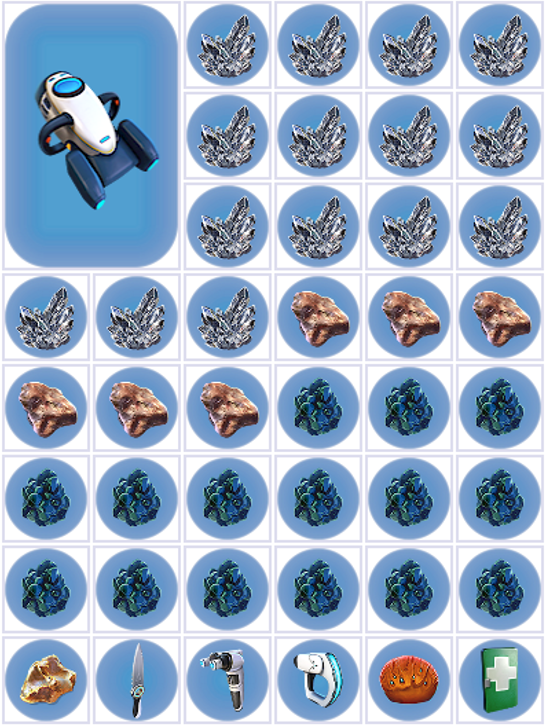
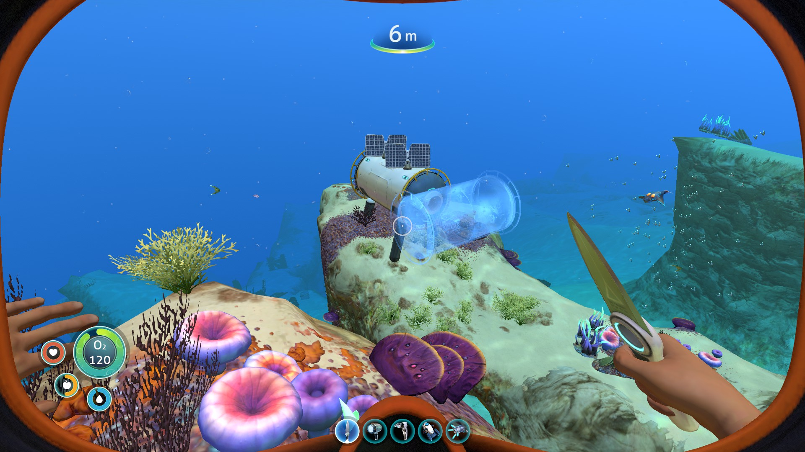
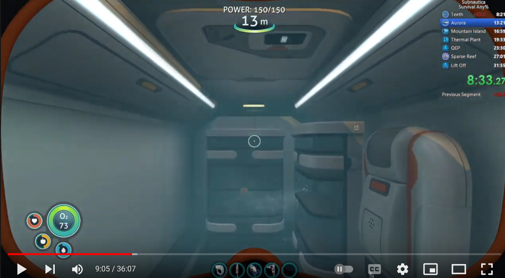
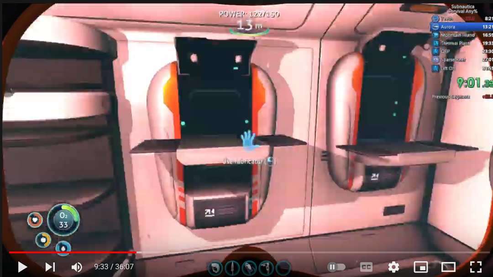
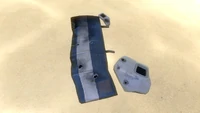
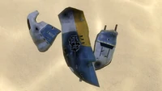
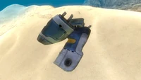
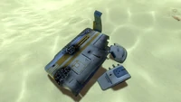

# Seaglide + Sandstone loop 1

## Sandstone

### Sandstone Loop

In this section, you will go on a loop through the shallows, collecting 6 Sandstone, 3 Table Coral, and as much Limestone as you can get your hands on. Below is a video showing you the route through the loop - I do explain it in the relevant part, it's hard to convey something like this in text.

Insert video link

One thing to note - you can choose which end of the loop (Ok, it's not actually a full loop - we just call it that) to start , and just go through it in the opposite direction depending on which end your spawn is closer to.

### Sandstone Cycles

Sandstone drops, like every other resource in this game, are effectively grouped into buckets. Limestone is a simple example, with a bucket of size 2. This means that every 2 limestone you break, you will always get 1 limestone and 1 copper, not necessarily in that order.

Sandstone works in a similar way, except its bucket has a size of 8. You will get 3 Silver, 3 Lead and 2 Gold from every 8 Sandstone you break, though once again, not in that order. This is why we do most of our Sandstone counting in multiples of 8 - in the first loop you collect 6, and then get 2 more during the stroll. After those 8, you get 8 more at the geyser, then collect a total of 24 (plus 1 gold, but I'll go into that in the relevant section)!

We can easily know how many of each resource we get just from how many sandstone we collect - I hope this make it clearer as to why we have to keep such good count of your Sandstone.

## Route

Now you're back at the lifepod, craft 1 Silicone Rubber, 1 Lubricant, 1 Copper wire, 1 Battery, 1 Knife, 1 O2 Tank (if you didn't make it before), and a seaglide.

You'll need to make a total of 6 glass before the first proper crafting section, 2 of which are necessary after teeth, so make at least 2 here, and then the rest later.

Before you leave, dump all the resources on you, except the 2 acid mushrooms, into the lifepod locker, and count your quartz. If you have made some glass, count 2 quartz for each glass. Remember how much quartz you have.

Before you leave, activate ghost storage again.

You'll now start the [Sandstone loop](#sandstone-loop). In the above section, I have a video showing this route. You can actually start the loop at whichever end of it is closest to your spawn, but here I am only going to explain it as if it were a good Clip A spawn - if you have a spawn closer to the other end, you effectively have to do the following in reverse order.

Swim to the low ceiling cave, and start collecting all the sandstone, quartz and limestone you can see. You will need a total of 21 quartz, so start counting at how many you counted before leaving, and keep track of how much you pick up. Once you reach 21, you can stop collecting quartz.

There are 3 guaranteed sandstone in this cave - get them all. Swim out of the other end of the cave, and round to the closest exit/entrance of the cave that cuts through the Coral tube. Slash 3 table coral and pick up the 3 pieces you get before you enter the cave. Continue collecting quartz and limestone. Swim through the middle of the Coral tube, and through to the other side. There are 3 sandstone in this cave also, so collect them all. Leave out the left of the two exits, and grab any Quartz or Limestone you see here.

If you have a spawn closer to this end ("the exit," as it were), you can start this loop there and go through it in reverse order. It doesn't make a difference which way you go through, so pick the entrance closest to you.

By this point, you'd like to have 2 gold, but it's possible the first 6 sandstone don't give you that. You'll be able to get it during a later section. If by the end of this loop, you're still short by a couple of quartz, you can grab the rest on one of the later resource loops.

If you spot metal salvage as well, you can pick it up here. Remember to keep adding these to your count, as, by the end of the last resource loop, you will have needed to collect a total of 9 salvage. If your inventory gets full, you can open your PDA and dump anything you can into ghost storage to give you some extra space. You can use that as an opportunity to double-check your quartz if you weren't counting/forgot your count.

Return to the lifepod, and start crafting: one copper wire, a battery, a computer chip, and a wiring kit. With that, you can craft a habitat builder. The old route required you to craft 4 glass here, but as I said earlier you just need to have made a total of 6 by the time you leave for teeth. So, with the remaining power in your lifepod, instead make any metal salvage you picked up into titanium to be sure you have enough to complete the base. If you still have power left, you can make as much glass as you can as well.

### Base placement/mushroom flood

You will need 8 titanium, 1 Table Coral, 1 Gold (If you didn't get enough gold, that's fine, it isn't necessary right now), 7 Quartz and 2 Copper in your inventory. You will probably have more Quartz and Copper than that in your inventory already, so just fill the rest of your inventory with titanium (you might not have enough to finish the lockers and such, if/when this happens just pick up the rest from ghost storage).

Your inventory should look somewhat like this:

Activate [ghost storage](./spawn-scanner#ghost-storage), then leave. Build your base in the correct place for your spawn and
mushroom flood. It's really hard to explain this in a document, so I will rely on Eclypsed's video
explaining it all:

<YouTubeVideo videoId="SYv79xjzH4w" />

When you build your base you should have one compartment, one hatch, and two solar panels. You will also need to build a "ghost glass compartment" to allow you to skip exit animations. All you need to do is start build a glass compartment in front of the hatch, and perpendicular to the way the other compartment is facing (while not having any glass in your inventory):

On the inside, place a fabricator (don't worry if you can't finish it) and two lockers. While you're making the lockers, you can take this opportunity to also craft the rest of the glass, to make your total to 6 assuming you were able to finish the fabricator. I hope you were keeping track!

If you got pretty unlucky during your first loop, and you don't have enough resources, you don't need lockers and fabricators at this point. You can just flood, get SSG, and then get the remaining stuff you need during the stroll, and build everything later.

I'd highly recommend making at least one locker to dump stuff into though, otherwise you'll probably run out of space during the stroll. Of course, if you do have the resources to make everything, do so.

Finally, begin making a second fabricator next to the first. You won't have the resources to finish the second fabricator, that's fine, you'll be able to finish it later.

The inside of your base should look something like this (These are placeholder images till I can actually load up subnautica and take some better ones):

Dump everything in the right locker, and leave. Now swim under your base and perform mushroom flood as outlined by the [video I linked earlier](https://www.youtube.com/watch?v=SYv79xjzH4w). The reason we do mushroom flood is to allow for probably the most useful glitch in this whole run, Super Seaglide, or SSG for short. When we're in a base as it floods, or partially deconstruct and reconstruct the hatch of a flooded base we're in, the game gets confused and decides that after we leave the base, we're both swimming and walking at the same time (only while holding out our seaglide). This means that we can swim much faster than we would be able to normally. If you accidentally leave the water or enter the lifepod/an unflooded base, you lose SSG and will have to get it again to go fast.

You'll respawn inside the base, and once again you should leave to go for a mini stroll.

### Stroll

Your base will have flooded by the time you respawn and now you have SSG. Next, collect 2 sandstone (If you're at [Clip A](./spawns#clip-a), you can grab 3 extra sandstone in the cave there. If you're lucky, you can get a gold and make the second fabricator early. But remember to count the extra sandstone you get!), grab 4 acid mushrooms, and 10 table coral. If you want, you can also get more metal salvage here too. But remember to keep count of your salvage! If you're missing any other resources to finish anything else in your base, you can also grab them now.

Go back to your base, and grab two copper. Finish the first fabricator if necessary. Craft two batteries and if you couldn't before now is an optimal time to make the rest of your glass. Dump all resources in the right locker, and head out for teeth.

### Teeth

SSG over to the kelp forest by the exit of the good coral tube. Teeth are annoying and dull, but necessary. The general strategy for getting teeth is to pick up metal that you find, and drop it near Stalkers (who I will now refer to as "dogs", from here on out). When dogs pick up metal, there is a chance that a tooth is dropped, so our job is basically to bring as much metal as we can to the dogs.

There is one slight caveat - one of the types of metal has a 0% chance of dropping a tooth! Remember which is the bad metal and don't drop them, try and pick them up yourself, so the dogs don't get them. The following image is what bad metal looks like:

The good metal salvages are as follows:

You need a total of four teeth before leaving this section, so it's usually a couple of minutes of basically just managing metal. If you spot any MVB during the teeth section, make sure to scan them.

[Insert MVB box image]

Another tip usually given is to try and keep the metal floating, instead of just sitting on the ground. A lot of the time, when a metal is on the ground, it's because a dog has put it in his nest. Dogs won't pick up metal again unless you move it out of the nest area. As well as this, teeth can sometimes fall through the map if the dogs poker their head through the ground when picking up the metal, so it's a good idea to keep them floating for this reason as well.

Once you have all four teeth, slice the creepvine twice to get two samples, and then grab three creepvine seeds. Fill the rest of your inventory up with metal salvage as you swim back to base. You should have space for 3 extra metal salvage, and have a couple space left over for any limestone or sandstone you find. Remember to keep counting your total metal salvage, and counting any extra sandstone you've collected
