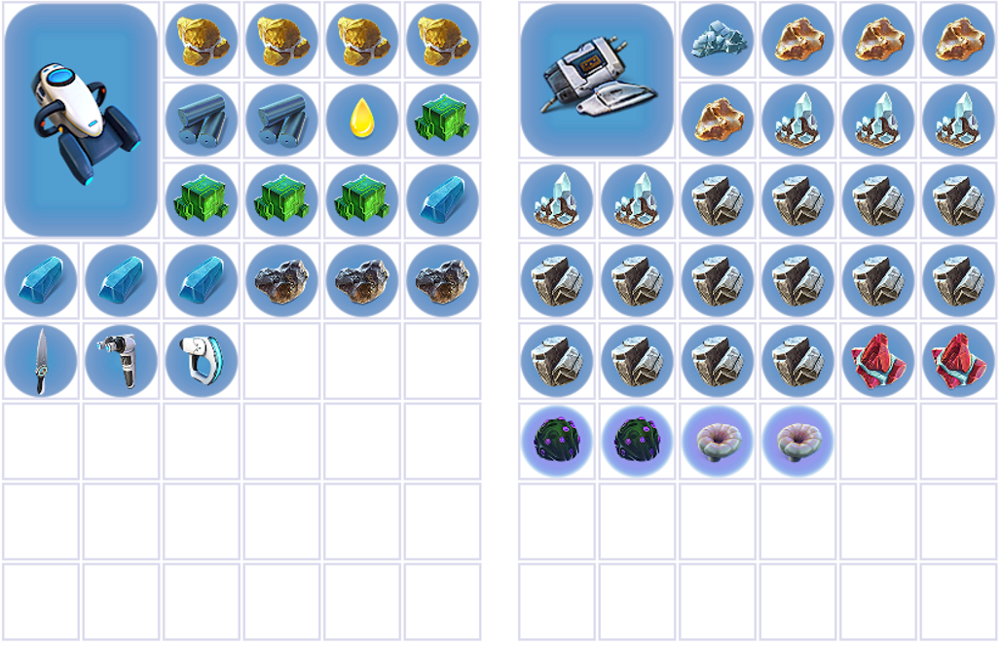

# Sparse

## Flare Storage

After you respawn, reequip your O2 tank.

Go back to your base in the shallows, and if you need to swap out any batteries. Activate SSG. If you got the extra purple tablet at the mountain, it will be in the left locker here. You'll need that at sparse, so get it now.

You'll also need to need to grab 3 glass and 3 teeth, and craft 3 enamelled glass here. Store them in the right locker.

Activate flare storage on the left locker.

## Glide to sparse

You now need to go to the sparse reef. I've linked a video that tehxenor made solely on getting to the sparse reef, so I will refrain from going into detail (this video covers pretty much everything you need to know). If you've been getting the right amount of titanium, you won't have enough to make the dupe base when you return from sparse, so you'll need to collect one on the way.

<YouTubeVideo videoId="SmkzMXdb87w" />

As the video tells you, once you get to Jeffrey the reefback, you can swim down to find the cave where you will collect your resources.

## Resources (Gel Sacks, Rubies and Salt)

In this cave, you need to collect 2 Gel sacks, 2 rubies and any backup lithium you didn't get at the mountains.

You can't actually find salt in this cave, but you will definitely pass one as you navigate through the sparse. There are some around the cave, and some around the rest of sparse if you don't find one here.

Leave the cave and align yourselves with these holes in the ground you can see here.

[Insert picture]

Continue in that direction, and you will come across a little hill with a cave entrance on the left side of it. Head down, and pretty much all the way round to the left, and you will see the entrance to an ion cube cache.

## Ion cubes

Unlock the cache with your tablet, and grab either 3 or 4, depending on whether you got one extra at the QEP.

Once you have the cubes, leave the cache way you came in - going left, then right, then left again. Once you're out, continue forward and you will find the wreck we use to get the remaining cyclops blueprints. On your way out, if you see a fish you can grab, pick it up.

Blueprints (Hull + Bridge + Shield gen)

Build a compartment that goes half into the wreck. When you make this, it'll make the outside of the wreck disappear, revealing all the fragments inside.

[Insert picture]

You'll need to scan 3 hull fragments and 3 bridge fragments.

[Insert picture of different fragment types]

You will also need to get the cyclops shield generator in this data box:

[Insert image]

We can actually do another fish skip here to save a second or so. Just like you did for the tablet, release the fish, then immediately click on the databox, except this time swap immediately to the scanner to allow you to scan another fragment earlier. This will overlay some animations and release you slightly earlier.

If you can't find all the fragments, have a look around the general area. There tend to be random spawns of hull and bridge fragments just around the sparse reef.

Once you've got all the required fragments, continue past the wreck. You will see a X-like formation in the ground, and the rightmost part of it has the entrance to the deep shroom cave.

[Insert image]

The video I linked earlier explains the navigation around the sparse really well, so if you still aren't sure from my instructions (they aren't amazingly clear), then this video should be very helpful.

## Deep shrooms + death

In this cave, you need to collect 3 deep shrooms. Open your flare storage and dump anything you picked up since leaving your base. This is typically 1 salt, 2 rubies, 2 gel sacks, three deep shrooms, any backup lithium you needed to grab and the metal salvage you collected on the way to sparse.

Your inventory/flare storage should look something like this:

After doing this, close your inventory and slash the deep shrooms to commit toaster bath.
