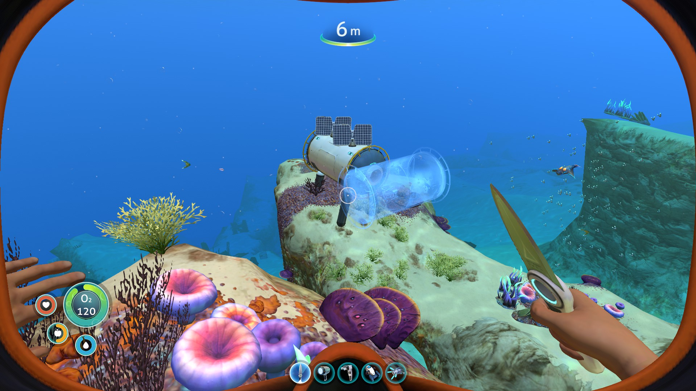

# Spawns

## Safe Shallows

One of the first and most important things to learn for this run is where the spawns that you want
are. In the picture below, you can see all the possible spawns marked in black, and the good
spawns marked in red.

(update this image when I have my mouse and not just the trackpad on my
laptop to draw with)

Here is an annotated map of the safe shallows - compare this with the picture above to get an
idea of where we want to be spawning. (You'll notice it's pretty much centred about the Good
Coral tube (#2 in the picture)):

It's quite hard to explain the shallows and good spawns in text, but luckily Rubiks has put together
a really great video about navigating the shallows and the different spawns. It's slightly out of
date, but it's still very useful (especially in conjunction with the above maps):

<YouTubeVideo videoId="UImO9pWTtOw" startTime={95} />

## Clips

Where you spawn has an affect on some later parts of the run. Specifically, when you clip out of
bounds in the Lava zone, you want do it in a way that your MVB ends up as close to your base as
possible (it floats up to the surface after we leave it in the lava zone).

There are only a few good places in the lava zone to clip OoB, so we effectively categorize spawns
by which of the two clips they relate to: Clip A, or Clip C.

We have two different base setups depending on whether you get Clip A or Clip C,and each clip
also has a relevant Cave where there is guaranteed enough Sandstone to get the remaining two
after the 6 you get on the first Sandstone cycle.

There used to be a Clip B but it's kinda trash and is never used.

### Clip A

I've marked on the map below which spawns we categorize as Clip A:

You can see that it's effectively everywhere to the right of the good coral tube (if you're facing the
entrance).
This is where you will setup your base for Clip A:

<YouTubeVideo videoId="SYv79xjzH4w" startTime={22} />

The sandstone cave for Clip A is marked on the above map as 4b.

[Insert video]

A side note - the Clip A cave actually has 5 guarunteed sandstone spawns, compared to the 2 of
the Clip C cave. When you go to collect the remaining 2 Sandstone, if you have a Clip A spawn, you
should also get the extra 3 sandstone as well (remembering to count it). Because there is 3 more
sandstone, there is about a 74% chance of getting the 3rd gold here, which allows you to make
the second fabricator slightly earlier.

There are several advantages to this, including the following:

- Speeds up crafting of the resources after returning from teeth.
- Gives you another opportunity to collect any quartz you may be short on (the Clip A cave tends to have a good amount of Quartz).
- There also tends to be lots of limestone in said cave, which means on average you won't have to collect as much copper from the geyser.
- Also, getting three sandstone earlier is nice, as there's less searching for random sandstone later.

For these reasons, a lot of runners prefer Clip A to Clip C, although Clip C is 100% fine.

### Clip C

I've marked on the map below which spawns we categorize as Clip C:

You can see it's pretty much everything to the left of the good coral tube, and any spawns
above/aligned with the coral tube.

I've included some spawns closer to the Clip C cave (4a), that are on the verge of being bad
spawns. If you're going for really competitive times, it's probably better to go for something like
this:

There are two places you can setup your base for Clip C:

<YouTubeVideo videoId="SYv79xjzH4w" startTime={95} />

The sandstone cave for Clip C is marked on the above map as 4a. It only has 2 sandstone in it,
compared to the 5 at Clip A.

[Insert video]

:::note Metal Salvage

During the entire shallows and kelp sections, you will need to keep track of metal salvage you pick
up. There are multiple places where I say you can collect salvage, and all of them you will need to
count. By the end of the last resource loop, you will need to have collected a total of 9 metal
salvage.

:::
